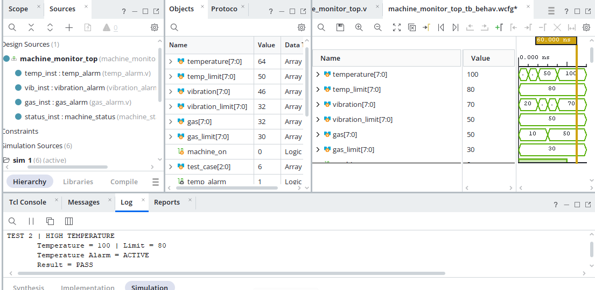
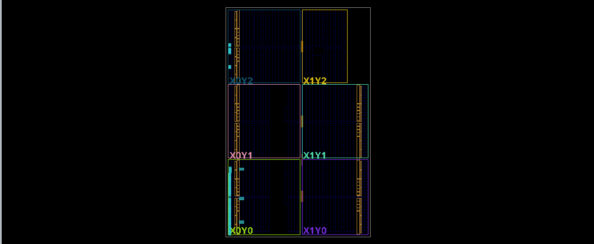

# Industrial Machine Monitoring System (Verilog / FPGA)

## Overview
An FPGA-based industrial safety monitoring system designed in Verilog HDL using AMD/Xilinx Vivado. The system continuously evaluates real-time sensor inputs (Temperature, Vibration, Gas levels) against configurable safety limits and triggers instant visual alarms and machine safety states without CPU/software latency.

## Key Features
- **Parallel Threshold Evaluation:** Simultaneously processes temperature, vibration, and gas sensors.
- **Hardware Safety Triggers:** Generates immediate alarm flags (`temp_alarm`, `vibration_alarm`, `gas_alarm`) and an overall machine status output.
- **Modular RTL Design:** Separated into clear sub-modules for scalability and testbench verification.

## Repository Structure
- `rtl/`: Core Verilog HDL design sources (`machine_monitor_top.v`, `temp_alarm.v`, `vibration_alarm.v`, `gas_alarm.v`, `machine_status.v`).
- `tb/`: Verilog behavioral testbench (`machine_monitor_top_tb.v`).
- `docs/`: Simulation waveforms, RTL schematics, and implementation utilization reports.

## Implementation & Resource Utilization
- **Target Device:** AMD Artix-7 (`xc7a35tcpg236-1`)
- **Synthesis Tool:** AMD Vivado 2026.1
- **Slice LUTs:** 12 / 20,800 (< 1%)
- **Slice Registers:** 3 / 8,150 (< 1%)
- **I/O Pins:** 53 / 106 (50%)
- **Timing:** Passed with 0 failing endpoints
## Input / Output Signal Mapping

| Signal Name | Type | Description |
| :--- | :--- | :--- |
| `clk` | Input | System Clock Signal |
| `rst` | Input | Active-High System Reset |
| `temp_in[7:0]` | Input | 8-bit Temperature Sensor Input |
| `vib_in[7:0]` | Input | 8-bit Vibration Sensor Input |
| `gas_in[7:0]` | Input | 8-bit Gas Level Sensor Input |
| `temp_alarm` | Output | Temperature Safety Alarm Flag |
| `vibration_alarm` | Output | Vibration Safety Alarm Flag |
| `gas_alarm` | Output | Gas Safety Alarm Flag |
| `system_shutdown` | Output | Master Machine Shutdown Signal |
## Hardware Verification & Implementation

### 1. Behavioral Simulation & Testbench Verification

*Behavioral Simulation Waveform*

*Testbench Verification Log & Console Output*

---

### 2. Resource Utilization & Synthesis Reports

*Resource Utilization Summary (Part 1)*

*Resource Utilization Summary (Part 2)*

*Logic Cell & LUT Usage Breakdown*

*I/O Pad & Power Analysis*
---

### 3. FPGA Physical Device Layout

*Physical Placement & Die Layout on Xilinx Artix-7*
